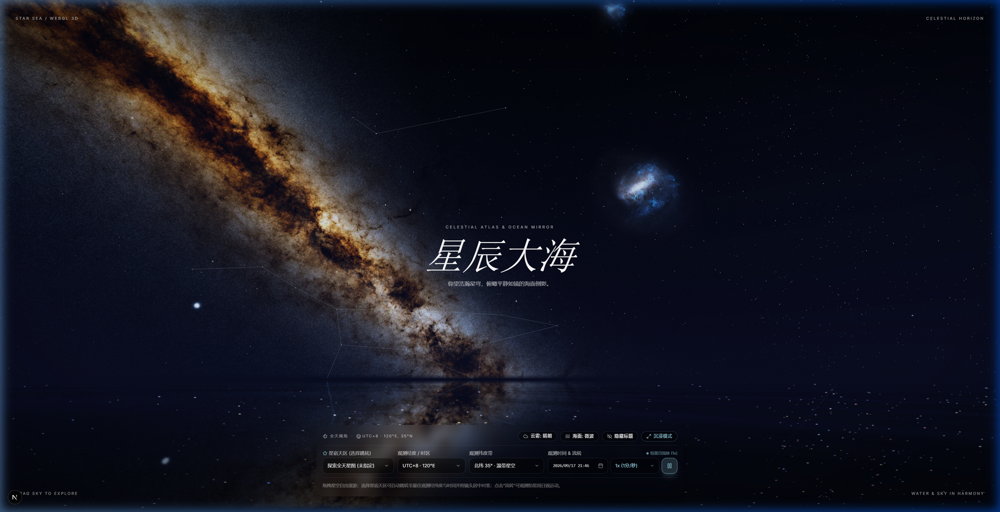

<div align="center">



# Star Sea Hero · 星辰大海

**仰望浩瀚星穹，俯瞰平静如镜的海面倒影**

基于真实天文星表、8K 银河天球与物理水面着色器的 WebGL 3D 沉浸式星空与海面镜像系统

[](LICENSE)
[](https://nextjs.org/)
[](https://threejs.org/)
[](https://react.dev/)
[](https://www.typescriptlang.org/)
[](#性能与架构优化)

</div>

---

## 🌟 核心视觉展示与艺术效果

Star Sea Hero（星辰大海）旨在浏览器中打造兼具**天体物理严谨性**与**唯美艺术感染力**的高保真 3D 实时宇宙海洋图景。用户可置身于水天之间，随昼夜流转观赏星河倾泻与波光倒影。

---

### 1. 🌌 8K 高清银河全景穹顶与深空天体
- **天球坐标精密投影**：以真实 J2000 赤道坐标系为基准，经过严格的天文矩阵变换，实时还原天球与银道在不同经纬度、时刻下的天体朝向。
- **震撼银河全景**：细致呈现银心人马座茶壶、天鹅座暗星云尘埃裂带、银河光弧与星际暗云的深邃对比。
- **真实深空天体呈现**：
  - **仙女座大星系 (M31)**：清晰呈现带有尘埃环的巨大螺旋星系。
  - **麦哲伦星云**：南半球可见的大麦哲伦星系 (LMC) 与小麦哲伦星系 (SMC)。
  - **猎户座大星云 (M42) & 昴星团 (M45)**：星光熠熠的深空星团与弥漫发射星云。

---

### 2. ✨ 真实星表与 21 个经典星座连线
- **精确视星等计算**：加载全天数百颗著名亮星（天狼星、织女星、牛郎星、天津四、大角星、老人星、北极星等），真实模拟恒星视亮度、色温与远近闪烁。
- **中西融合星宿连线**：
  - 收录 **21 个代表性星座天区**（黄道十二星座、北斗七星、夏季大三角、冬季大三角、南十字座等）。
  - **地平遮挡算法**：当地球自转使星座没入地平线以下时，水下星星连线与星点被真实遮挡，保证水上视野真实可信。

---

### 3. 🌊 动态双形态海面与星光镜像倒影
- **微波粼粼模式（Rippled Waves）**：
  - 采用预计算的多频段 **Gerstner 物理重力波算法**，波峰尖耸、波谷平缓。
  - 星光与银河投射在涌浪法线上被微秒级粉碎与扰动，呈现璀璨斑斓的波光。
- **水平如镜模式（Calm Mirror）**：
  - 水面静止如平滑无瑕的水银之镜。
  - 银河光斑与每颗亮星在地平线下方完美倒影，水天一色，视觉极富张力。

---

### 4. 🌅 真实水天相接与地平线大气消光
- **柔和水天交汇**：彻底去除机械突兀的黑色切线，利用视线倾角、双曲渐变与法线微扰实现海空无缝交织。
- **大气光学消光（Atmospheric Extinction）**：低仰角天光与星辰受低空尘埃与更厚大气影响，呈现自然的暖色降亮与消光衰减。

---

### 5. 🧘 极简与纯净沉浸式观星
- **中心标题收折**：一键隐藏/重现居中文案，视野瞬间通透宽广。
- **全界面纯净沉浸模式（Immersive Mode）**：
  - 一键隐藏四角状态信息、居中文案及底部全部控制栏。
  - 仅留下 3D 星河与海面，化身纯粹沉浸的治愈系观星屏保。
  - **防误触三击重现**：在画面任意空白区域**连续点击 3 次**即可瞬时重现完整交互 UI。

---

### 6. 🕒 时空旅行与自动周日视运动
- **自动恒星日视运动**：恒星与银河以真实恒星日速率（约 23h 56m 04s）围绕地轴旋转，支持 1x ~ 60x 倍速延时摄影效果。
- **全球地理纬度与时区自适应**：
  - 预设赤道、北回归线、温带星空、北极圈、南半球高纬度带。
  - 结合 UTC 经度自动换算地方恒星时（LST）。
- **一键智能寻星**：点击任一星座，系统自动定位到其全年**最适宜观测月份、黄金时刻与观测纬度**，平滑将目标星座居中于正前方夜空。

---

## 🎮 交互控制说明

| 功能栏目 | 快捷操作 | 效果说明 |
| :--- | :--- | :--- |
| **视角漫游** | 鼠标左键拖拽 / 触摸滑动 | 360° 自由旋转环顾天球与海面，带惯性平滑阻尼 |
| **星宿天区** | 下拉菜单选择 | 自动跳转并智能匹配最佳可见季节与仰角 |
| **经度 / 时区** | 下拉菜单选择 | 跨越全球各大代表性城市时区与经度基准 |
| **纬度带** | 下拉菜单选择 | 体验由北天极到南天十字座的星空纬度演变 |
| **时间与流转** | 日历时间选择 / 播放开关 | 自由设置任意历史或未来时刻；支持 1x/5x/15x/60x 倍速 |
| **海面波况** | 微波 / 平静 切换按钮 | 在动感 Gerstner 重力波与平静镜面倒影之间自由切换 |
| **夜云与薄雾** | 晴朗 / 簿霭 切换按钮 | 调节地平线附近的星夜薄雾与朦胧氛围 |
| **隐藏标题** | 眼睛图标按钮 | 隐藏/显示中间的主标题诗意文案 |
| **全屏沉浸** | 沉浸模式按钮 | 完全隐藏全部 UI；在画布任意处**连点 3 次**恢复 |

---

## ⚡ 性能与架构优化

- **WebGL 直出秒开**：零冗余封面图及预载视频，直接在第一帧编译着色器并平滑淡入三维画面。
- **零 GC 渲染循环（Zero GC Allocations）**：
  - 矩阵计算、向量池、投影坐标复用全局单例，避免逐帧垃圾回收造成的微掉帧。
- **Gerstner 物理波常量预计算**：
  - 重力加速度与波数等在 GPU/CPU 启动期预固化，着色器内部逻辑零动态分支。
- **自适应像素比（DPR Clamp）**：
  - 高分屏最大限制 DPR ≤ 1.5，有效削减 50% 以上全屏像素填充率开销，主流设备稳稳维持 60 FPS。
- **全自动化质量保障**：
  - 包含 **16 项 Playwright 端到端浏览器测试**及 **9 项 Vitest 单元测试**，覆盖全设备响应式、暗夜视运动与交互稳定性。

---

## 🚀 本地运行与开发

### 环境要求
- Node.js ≥ 18.18.0
- npm / pnpm / yarn

### 快速开始

1. **克隆仓库**
   ```bash
   git clone https://github.com/chenzhaoxuan0/star-sea-hero.git
   cd star-sea-hero
   ```

2. **安装依赖**
   ```bash
   npm install
   ```

3. **启动开发服务器**
   ```bash
   npm run dev
   ```
   浏览器打开 [http://localhost:4010](http://localhost:4010) 即可实时体验。

4. **生产环境静态导出**
   ```bash
   npm run build
   ```
   构建产物将输出至 `.next` / 静态单页，可无缝部署至 Vercel、Cloudflare Pages、GitHub Pages 或静态 CDN。

5. **执行测试套件**
   ```bash
   npm run test        # Vitest 单元测试
   npm run test:e2e    # Playwright 端到端自动化测试
   ```

---

## 📂 项目结构

```
star-sea-hero/
├── assets/                       # 视觉展示图与媒体资源
│   └── star-sea-hero-preview.png # 顶部实际运行全景效果截图
├── public/
│   └── textures/                 # 8K/4K 真实银河天球贴图
├── src/
│   ├── app/                      # Next.js 15 App Router 页面骨架与全局样式
│   ├── components/               # 画布、控制 Dock、沉浸引导等核心组件
│   ├── data/                     # 真实星表（HIP/恒星星等）、21个星座中西数据
│   ├── lib/
│   │   ├── astronomy/            # J2000 赤道到地平坐标、恒星时、寻星算法
│   │   └── rendering/            # Three.js 场景构建、海洋 GLSL、天幕着色器
│   └── types/                    # 天文与渲染 TypeScript 类型定义
├── tests/                        # Vitest 算法测试 & Playwright E2E 测试
├── LICENSE                       # MIT 开源协议
└── README.md                     # 项目核心视觉与架构说明文档
```

---

## 📄 开源协议

本项目采用 [MIT License](LICENSE) 协议开源。欢迎自由学习、分享、衍生与应用。
